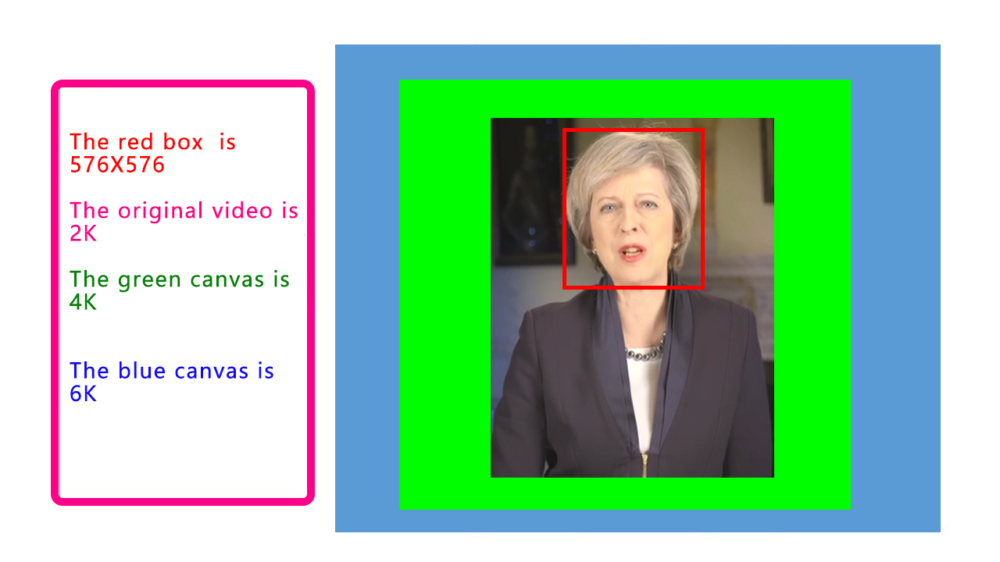

# wav2lip-576x576 introduction
This is a project about talking faces. We use 576X576 sized facial images for training, which can generate 2k, 4k, 6k, and 8k digital human  videos.

We have optimized in the following areas:
1. Using Hubert for audio processing, there is a significant improvement compared to wav2lip-96 and wav2lip-288.
2. Optimized dataset processing, eliminating the need to manually cut videos into seconds.
3. We have optimized the network structure to better extract features.
4. We trained the base model with a high-definition dataset of hundreds of people. Although its generalization ability is not strong, the effect is very good after single or multi person fine-tuning.

# wav2lip-576x576 Project situation

  <b>
    <a href="https://space.bilibili.com/431556168">Video </a>
    | 
    <a href="https://github.com/langzizhixin">Project Page</a>
    |
    <a href="https://github.com/langzizhixin">Code</a> 
  </b>

 
  
  
    
  

